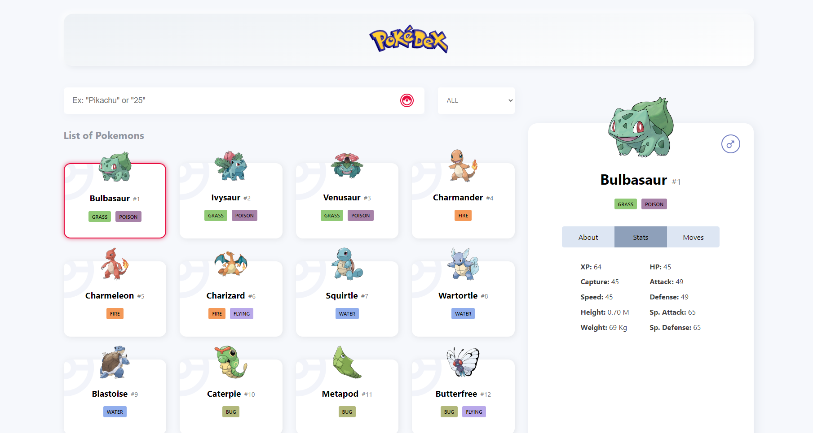

# Pokedex
Acredito que quase todo mundo conhece o anime chamada Pokemon, e ainda, que quase todo desenvolvedor front-end já ao menos ouviu falar do [PokeAPI](https://pokeapi.co/) e já pensou em fazer um projeto de Pokedex para treinar suas habilidades de desenvolvimento com consumo de dados de APIs de terceiros. Então, comigo não foi diferente, e eu sempre pensei em fazer este projeto front-end, mas sem nunca sentir uma real motivação, até me aparecer o [Bootcamp Orange Tech +](https://web.dio.me/track/81278323-8916-401b-8446-03118eaff280) da DIO, cujo estabeleceu como um de seus desafios de projeto este mesmo referente à Pokedex suprida pale PokeAPI.

Assim, este é o resultado de alguns dias de esforço para desenvolver uma interface amigável, sofisticada e bastante completa em termos de informações e opções de navegação e personalização entre os dados obtidos através do consumo da referida API.

---

## Projeto
Este projeto foi criado usando React e TypeScript, e até o momento para a estilização está sendo adotado o CSS padrão, mas com a possibilidade de ser modificado para o Styled-Components nas próximas atualizações.

Atualmente o sistema conta com um sistema de rolagem infinita suportado pela biblioteca Axios que faz as requisições para a PokeAPI, assim como um sistema de filtros por tipos de pokemons e busca por nome ou ID. Ainda, é possível selecionar um dos diversos pokemons para observar mais informações sobre este no card lateral que acompanha a navegação vertical do usuário, e tem informações gerais sobre o pokemon, dados de estatisticas e os movimentos deste mesmo pokemon. Ainda, para modelar os dados dos pokemons, é usada a classe Pokemon, que contêm todos os dados necessários para os objetos que serão trabalhados no sistema.

---

## Próximos passos

1. Integrar os campos de detalhes, geração, habitat, captura, genero e lendario dentro do objeto pokemon instanciado da classe Pokemon, mas como a requisição é feita antes de receber o objeto, quebra tudo quando tento declarar o pokemon.setDescription... Outra opção seria criar outra classe, como PokeDetails que vai instanciar um objeto que vai ser usado para manipular os valores adicionais. Ah, e tamb´´em daria para ter um contexto global através do useContext que salvaria a lista de pokemons e o selected, assim todos os componentes teriam acesso sem precisar esperar chegar através de params.
2. Fazer a passagem de pokemons ser referente a lista que esta sendo exibida, e não a lista completa. Quando filtrasse teria que manter o que esta selecionado atualmente, mas ao clicar em qualquer pokemon, ao pressionar em anterior ou proximo teria que navegar entre aqueles atualmente aparecendo nos cards. Mas sso poderia gerar uma duplicacao de lista, e tambem iria querer uma mudanca na forma de selecao, pois o pokemon selecionado nao seria mais pelo id, mas sim pela posicao na lista exibida.
3. Elaborar um redesign para a versão mobile e quebrar a cabeça para fazer os ajustes no design e na dinâmica necessários para essas mídias móveis. Mas eu realmente não tenho nenhuma ideia agora, até por que eu be baseei em um design feito para desktop, então não pensei muito mobile-first para esse projeto em questão... Infelizmente.

---

## Créditos

* [AC1 Design](https://www.behance.net/angioletto1e90), criador do [design](https://www.behance.net/gallery/113562309/Pokemon-Pokedex-Website-Redesign-Concept?tracking_source=search_projects%7CPokedex) usado como base para a construção da interface.
* [Darius Dan](https://www.flaticon.com/authors/darius-dan), autor da [ilustração](https://www.flaticon.com/free-icon/pokeball_743977?term=pokeball&page=1&position=6&page=1&position=6&related_id=743977&origin=tag) usada como ícone do site.

---

## Imagem
